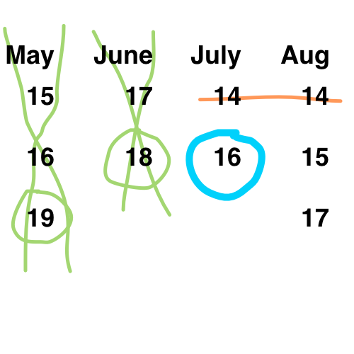

# singapore-olympiad
Solution to viral logic problem from April 2015 as reported on [The Daily Mail UK](http://www.dailymail.co.uk/sciencetech/article-3037266/The-maths-problem-set-Singapore-teenagers-left-people-world-stumped.html). My friend Mark has a complete breakdown of why every possible solution passes or fails [here](http://mark.github.io/olympiad/).

## When is Cheryl's Birthday?

*Albert and Bernard just became friends with Cheryl, and they want to know when her birthday is. Cheryl gives them a list of 10 possible dates.*

* May 15, May 16,  May 19
* June 17, June 18
* July 14, July 16
* August 14, August 15, August 17

*Cheryl then tells Albert and Bernard separately the month and the day of her birthday, respectively. 
**Albert**: I don't know when Cheryl's birthday is, but I know that Bernard doesn't know either. 
**Bernard**: At first I didn't know when Cheryl's birthday is, but now I know. 
**Albert**: Now I know when Cheryl's birthday is too.*

So when is Cheryl's birthday?

## How to Solve

### Knowns

Albert: knows month 
Bernard: knows day

The dates:
* May: 15, 16, 19
* June: 17, 18
* July: 14, 16
* August: 14, 15, 17

The conversation between Albert and Bernard is the key to the question, so don't discard it!

### The Conversation

Properly interpreting the conversation and noticing ***who*** is speaking (the one who knows the month or the day) is critical.

#### Albert speaks (first)

Albert: I don't know when Cheryl's birthday is, but I know that Bernard doesn't know either.

What this means: I wasn't given a month that has one of the unique days, so I know Bernard cannot deduce the month from the day he was given at this point.

* **May**: 15, 16, **19**
* **June**: 17, **18**
* July: 14, 16
* August: 14, 15, 17

**Elimination** Bold months eliminated, unique days also bolded for visual clarity.

#### Bernard replies to Albert (second)

Bernard: At first I didn't know when Cheryl's birthday is, but now I know.

What this means: I was given a day that is unique in the remaining set, which allows me to deduce the month.

* July: **14**, 16
* August: **14**, 15, 17

**Elimination** The 14th is common to both July and August, so both these dates are eliminated.

#### Albert replies to Bernard (third)

Albert: Now I know when Cheryl's birthday is too.

What this means: I was given a month that allows me to deduce the day.

* July: 16
* August: 15, 17

Since August has two options and July has one, the month he was given must be July. To further clarify: the only way Albert could also deduce the day for the month he was given is if there was only one day for him to choose.

#### Result: July 16th

#### TL;DR How I solved the problem on a piece of paper

* Green: Albert first
* Orange: Bernard second
* Blue: Albert third

